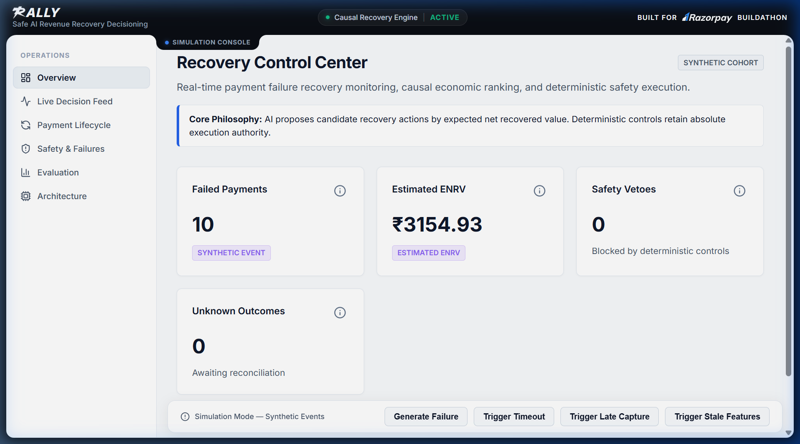
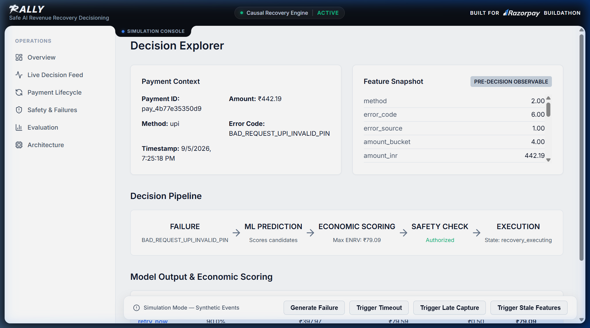
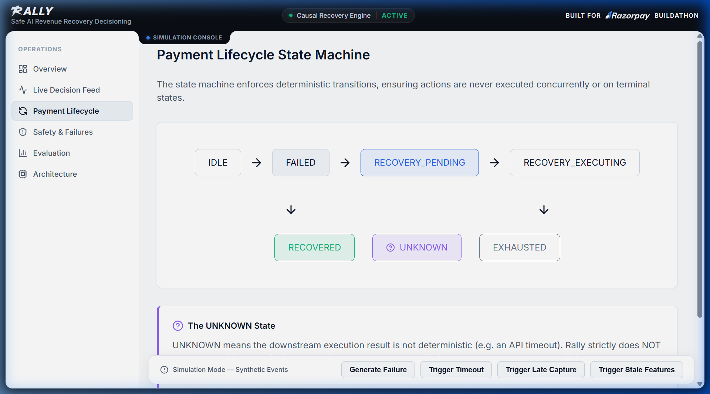
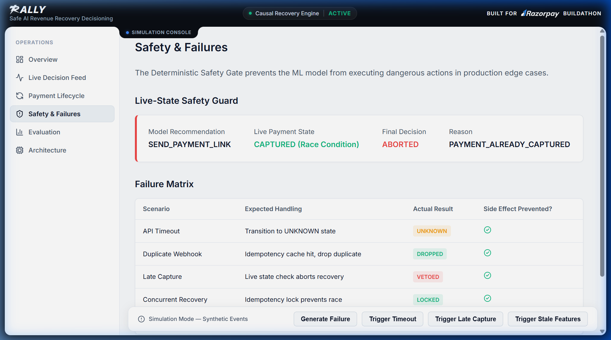
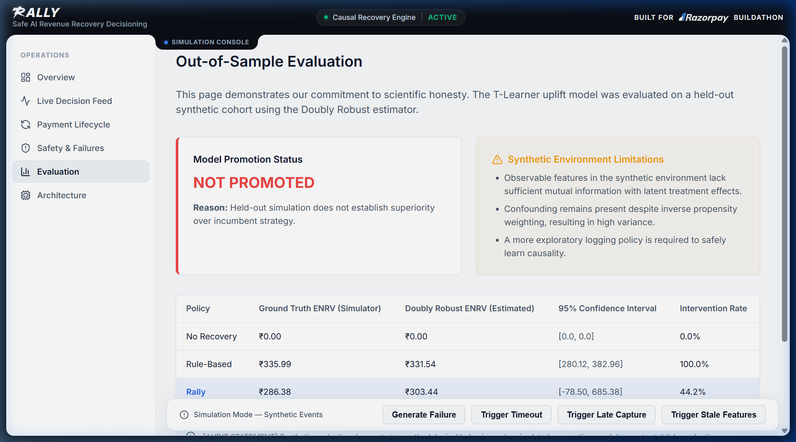
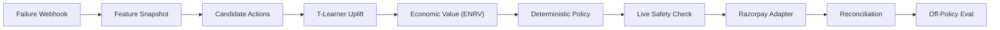
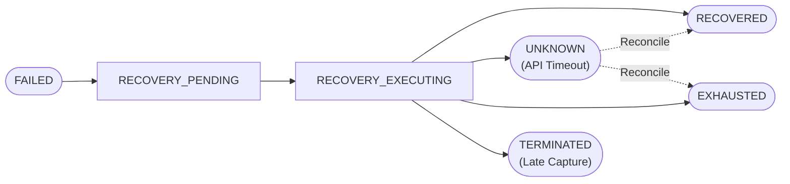
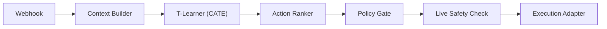
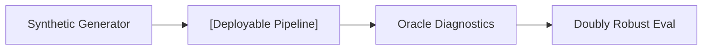

# Rally

**Safe AI Revenue Recovery Decisioning**

> Rally estimates the incremental economic value of recovery actions after a failed one-time checkout payment, while deterministic policy and safety controls retain final authority over execution.

> **Product:** Rally  
> **Internal Python Package:** `rally`

<p>
  
  
  
  
  
  
</p>

> **Simulation-first implementation.** All evaluation results are based on a synthetic simulation environment. No production revenue lift is claimed. The deployable model is evaluated against an incumbent rule-based policy and is **not promoted** when it underperforms.

<div align="center">
  
  <p align="center"><em>Rally Recovery Control Center: Real-time payment failure recovery monitoring, causal economic ranking, and deterministic safety execution.</em></p>
</div>

---

## Table of Contents

- [Visual Tour & Interactive Demo](#visual-tour--interactive-demo)
- [Why This Problem](#why-this-problem)
- [What We Built](#what-we-built)
- [Design Principle](#design-principle)
- [How Rally Works](#how-rally-works)
- [Architecture](#architecture)
- [AI Decisioning](#ai-decisioning)
- [Economic Decisioning](#economic-decisioning)
- [Safety and Failure Recovery](#safety-and-failure-recovery)
- [Causal Evaluation](#causal-evaluation)
- [Results](#results)
- [What Broke — and What the Audit Caught](#what-broke--and-what-the-audit-caught)
- [Tech Stack](#tech-stack)
- [Project Structure](#project-structure)
- [Run Locally](#run-locally)
- [How to Use the Application](#how-to-use-the-application)
- [Testing and Validation](#testing-and-validation)
- [Limitations](#limitations)
- [Future Work](#future-work)
- [Why This Belongs in Razorpay](#why-this-belongs-in-razorpay)

---

## Visual Tour & Interactive Demo

Rally includes a production-grade merchant operations dashboard designed to mirror the design language, typography, and UX patterns of Razorpay's merchant ecosystem.

### Interactive Live Walkthrough

<div align="center">
  
  <p align="center"><em>Screen Recording: Simulating payment failures, dynamic uplift ranking, and state machine transitions in real time.</em></p>
</div>

---

### Core Interfaces

<table>
  <tr>
    <td width="50%" valign="top">
      <h4 align="center">1. Decision Explorer & Pre-Decision Context</h4>
      <a href="docs/assets/rally_decision_explorer.png"></a>
      <p align="center"><em>Pre-decision feature snapshot (observables only), 5-stage pipeline tracking, and granular ENRV unit breakdown per candidate action.</em></p>
    </td>
    <td width="50%" valign="top">
      <h4 align="center">2. Payment Lifecycle State Machine</h4>
      <a href="docs/assets/rally_payment_lifecycle.png"></a>
      <p align="center"><em>Deterministic transition guarantees preventing race conditions: <code>IDLE &rarr; FAILED &rarr; RECOVERY_PENDING &rarr; RECOVERY_EXECUTING &rarr; RECOVERED / UNKNOWN / EXHAUSTED</code>.</em></p>
    </td>
  </tr>
  <tr>
    <td width="50%" valign="top">
      <h4 align="center">3. Safety Controls & Failure Matrix</h4>
      <a href="docs/assets/rally_safety_controls.png"></a>
      <p align="center"><em>Real-time safety veto tracking, idempotency lock enforcement, API timeout handling, and late-capture suppression.</em></p>
    </td>
    <td width="50%" valign="top">
      <h4 align="center">4. Out-of-Sample Causal Evaluation</h4>
      <a href="docs/assets/rally_causal_evaluation.png"></a>
      <p align="center"><em>Scientific rigor: Doubly Robust (DR) estimation on held-out test data showing explicit non-promotion when model does not establish superiority.</em></p>
    </td>
  </tr>
</table>

---

## Why This Problem

When a one-time checkout payment fails, merchants typically have two blunt options: do nothing, or uniformly blast every customer with a retry link.

These static policies fail because **payment failures are heterogeneous**:

| Failure Type | What Actually Happened | Best Recovery |
|---|---|---|
| Transient gateway error | Infra blip, customer intent intact | Immediate retry |
| Insufficient funds | Customer cannot pay right now | Wait or switch method |
| UPI timeout | Session expired, customer may retry | Wait 2–5 min |
| Card decline (hard) | Issuer rejection | Switch payment method |
| Customer cancellation | Deliberate exit | Do nothing |
| Temporary bank downtime | Bank-side issue | Wait and retry |

A uniform recovery action can:

- **Waste intervention cost** on customers who would self-cure
- **Annoy customers** with unnecessary retry notifications
- **Retry when recovery probability is near zero** (hard declines)
- **Execute against an already-captured payment** (race condition)
- **Create duplicate charges** from concurrent recovery attempts

The real decision is not "should we retry?" — it is:

> **"Which action has the highest expected incremental economic value, and is it still safe to execute?"**

This is the problem Rally solves.

---

## What We Built

Rally is an end-to-end decisioning and evaluation system for failed payment recovery. It forms a single closed loop:

**Detect** → **Contextualize** → **Predict** → **Value** → **Constrain** → **Execute** → **Reconcile** → **Evaluate**

The system implements:

1. **Contextual recovery decisioning** — Builds a pre-decision feature snapshot from payment metadata, error taxonomy, merchant config, and timing signals
2. **Causal uplift modeling** — T-Learner estimates the incremental treatment effect of each recovery action over doing nothing
3. **Economic ranking** — Converts probability uplifts into Expected Net Recovered Value (ENRV) in INR, accounting for contribution margin and intervention cost
4. **Deterministic policy constraints** — Hard rules (retry limits, opt-out, method eligibility) that cannot be overridden by the model
5. **Live-state safety verification** — Re-reads payment state immediately before execution to prevent acting on stale information
6. **State machine enforcement** — Tracks `FAILED → RECOVERY_PENDING → RECOVERY_EXECUTING → UNKNOWN → RECOVERED / EXHAUSTED / TERMINATED`
7. **Concurrency and idempotency** — Prevents duplicate recovery actions from concurrent webhook deliveries
8. **Unknown-outcome reconciliation** — API timeouts produce `UNKNOWN` state, not blind retry
9. **Webhook verification** — Validates Razorpay webhook signatures and deduplicates events
10. **Causal off-policy evaluation** — Doubly Robust estimator scores the deployable policy against logged data
11. **Full audit trail** — Every decision records model version, feature snapshot, uplift estimates, economic scores, policy constraints, and execution outcome

These are not independent features. They are stages in one orchestrated pipeline.

---

## Design Principle

> **AI proposes. Deterministic controls authorize.**

The ML model is intentionally **not** the final authority over execution.

| The model **can** | The model **cannot** |
|---|---|
| Estimate treatment effect / recovery probability | Bypass retry limits |
| Rank candidate actions by expected value | Ignore customer opt-out |
| Estimate expected net recovered value | Execute against captured payments |
| Recommend `do_nothing` when no action is justified | Execute on stale payment state |
| | Override `UNKNOWN` state |
| | Bypass idempotency controls |
| | Directly call payment APIs |

Every model recommendation passes through a deterministic policy gate and a live-state safety check before any side effect occurs.

---

## How Rally Works

### Decision Lifecycle



### Recovery State Machine



**Why `UNKNOWN` exists:** An API timeout does not mean failure. It means *we do not know the outcome*. The system transitions to `UNKNOWN`, suppresses further retry, and waits for reconciliation before determining the next action.

---

## Architecture

### Deployable Path (Production)



Every component in this path uses **only pre-decision observable information**. No simulator variables, no oracle labels, no latent ground truth.

### Evaluation Path (Simulation Only)



> **The Oracle is simulator-only and is not part of deployable decisioning.** It exists to score the deployable pipeline against latent ground truth that would not be available in production.

### Execution Boundary

- `MockRazorpayAdapter` — Used for safe local execution. Simulates API responses including timeouts, failures, and late captures.
- `RazorpayClient` — Live adapter boundary exists in `execution/razorpay_client.py`. Tests and demo default to mock.

No live production Razorpay API calls are made during simulation or testing.

---

## AI Decisioning

### Deployable Model: T-Learner

The deployable model is a **T-Learner** uplift estimator built on `HistGradientBoostingRegressor` (scikit-learn).

**How it works:**
- Fits a separate outcome model `μ̂_a(x)` per treatment arm (each `RecoveryAction`)
- Predicted uplift: `τ̂(x, a) = μ̂_a(x) − μ̂_control(x)`
- The control arm is strictly `DO_NOTHING` — uplift measures incremental lift over natural self-cure

**Input features** (pre-decision, observable only):
- Payment amount, method (`upi`, `card`, `netbanking`, `wallet`)
- Error source (`customer`, `bank`, `gateway`, `network`)
- Error code category
- Attempt number, time since last attempt
- Hour of day, day of week
- Merchant retry configuration

**What the model does NOT see:**
- Latent simulator variables (true recovery probability, oracle labels)
- Post-decision outcomes
- Future payment state

**Recovery actions** (9 candidates):

| Action | Side-Effecting | Cost (INR) |
|---|---|---|
| `do_nothing` | No | ₹0.00 |
| `retry_now` | Yes | ₹0.10 |
| `wait_2min` | No | ₹0.00 |
| `wait_5min` | No | ₹0.00 |
| `wait_10min` | No | ₹0.00 |
| `switch_upi_app` | Yes | ₹0.50 |
| `switch_to_card` | Yes | ₹0.50 |
| `send_payment_link` | Yes | ₹2.50 |
| `escalate_to_human` | Yes | ₹25.00 |

**`do_nothing` is a legitimate action.** If no intervention has positive expected incremental value, the optimal decision is to not intervene.

---

## Economic Decisioning

The economic layer converts model predictions into monetary terms:

```
ENRV(a) = Recovered Contribution(a) − Intervention Cost(a)
```

Where:

| Term | Definition | Unit |
|---|---|---|
| Estimated Uplift | `τ̂(x, a)` — incremental recovery probability over `do_nothing` | Dimensionless ∈ [-1, 1] |
| Recovered GMV | `τ̂(x, a) × amount_inr` | INR |
| Contribution Margin | Merchant margin fraction (default 20%) | Fraction |
| Recovered Contribution | `Recovered GMV × Contribution Margin` | INR |
| Intervention Cost | Direct channel + friction cost per action | INR |
| **ENRV** | `Recovered Contribution − Intervention Cost` | **INR** |

**Governing invariant:** If the best ENRV across all actions is ≤ 0, `DO_NOTHING` is strictly optimal.

> **Engineering lesson:** An earlier implementation had a unit-scaling bug where probability uplift was multiplied directly by cost without the GMV and margin conversion, producing quantities in `INR²`. This was caught during red-team auditing. Economic quantities are now explicitly typed and validated in the `ActionScore` dataclass to prevent unit errors.

---

## Safety and Failure Recovery

### Governing Invariant

> **Immediately before any side-effecting recovery call, Rally re-reads live payment state. If the payment is already `captured`, `authorized`, or `refunded`, execution is aborted.**

### Failure Handling

| Failure | System Behavior |
|---|---|
| Late capture (payment succeeded during recovery) | Abort side effect, transition to `TERMINATED` |
| API timeout | Transition to `UNKNOWN`, suppress retry, await reconciliation |
| Duplicate webhook | Deduplicate via idempotency store |
| Concurrent recovery attempt | Exactly-one locking per `payment_id` |
| Stale feature snapshot | Deterministic degraded mode (`STALE_FEATURES`), safe fallback |
| Model failure | Safe fallback to rule-based policy |
| Invalid prediction (uplift outside [-1, 1]) | Reject prediction, log anomaly |
| Model recommends action with ENRV ≤ 0 | Select `DO_NOTHING` |

### Degraded Mode

When the system detects stale features, model errors, invalid predictions, or schema mismatches, it enters **degraded mode** and falls back to a deterministic rule-based policy rather than operating on unreliable ML output.

---

## Causal Evaluation

### Why Naive Comparison Fails

A customer may recover **without any intervention** (self-cure). Therefore:

- `P(recovery | retry)` ≠ incremental value of retry
- A policy that retries every payment will take credit for self-cures
- The correct question is: **"How much additional recovery did the intervention cause?"**

### Three-Layer Scientific Separation

| Layer | Role | Available Information |
|---|---|---|
| **Oracle** | Simulator-only ground-truth diagnostic | Latent outcomes, true recovery probabilities |
| **Deployable Policy** | The actual system being evaluated | Pre-decision observable context only |
| **Off-Policy Evaluation** | Scores deployable policy on held-out logged data | Logged actions, propensities, observed rewards |

### Evaluation Methodology

1. **T-Learner** — Estimates `τ̂(x, a)` per arm using logged observational data
2. **Logged behavior policy** — Generates training data with known propensities
3. **Inverse Propensity Scoring (IPS)** — Re-weights logged rewards by propensity ratio
4. **Doubly Robust (DR) estimator** — Combines direct model estimate with IPS correction; unbiased if either the propensity model or reward model is correct
5. **Held-out test cohort** — Evaluation runs on data not seen during training

---

## Results

> **The current deployable model does not beat the rule-based baseline in the synthetic simulation environment.**

| Policy | DR ENRV/Event (Est.) | 95% CI | Intervention Rate | Status |
|---|---|---|---|---|
| No Recovery | ₹400.07 | [₹65.69, ₹734.45] | 0.0% | Passive baseline |
| Rule-Based | ₹334.27 | [₹308.88, ₹359.66] | 98.5% | **Incumbent baseline** |
| Rally | ₹228.45 | [₹67.11, ₹389.79] | 93.3% | **Not promoted** |
| Oracle Diagnostic | ₹299.43 | [₹204.91, ₹393.95] | 100.0% | Simulator-only |

**This result is intentionally preserved.** The model is not promoted when held-out simulation does not justify superiority over the incumbent.

Rally treats model promotion as an **evidence-based decision**, not an assumption. The evaluation infrastructure, safety controls, and decisioning pipeline are production-ready even when the current model is not.

---

## What Broke — and What the Audit Caught

| # | Problem | Detection | Fix | Regression Test |
|---|---|---|---|---|
| 1 | **INR/probability unit mismatch** — Uplift (dimensionless) multiplied directly by cost (INR) producing INR² | Red-team audit of `ActionRanker` | Explicit `ActionScore` dataclass with typed units; GMV × margin conversion | `test_uplift_calibration.py` |
| 2 | **Train/test contamination** — Oracle features leaking into deployable model training | Data boundary audit | Strict `ContextBuilder` that strips latent simulator columns | `test_data_boundary_regression.py` |
| 3 | **Degenerate timing baseline** — Wait actions producing identical uplift estimates | Timing bandit analysis | Separate timing-specific outcome models with distinct wait durations | `test_timing_bandit.py` |
| 4 | **Unsafe concurrency** — Duplicate webhooks triggering parallel recovery attempts | Concurrency stress test | `IdempotencyStore` with per-payment locking | `test_concurrency.py` |
| 5 | **Oracle leakage into deployable learning** — Model accessing simulator ground-truth | Causal red-team audit script | Hard boundary: `ContextBuilder` returns only pre-decision observable features | `test_data_boundary_regression.py` |
| 6 | **Insufficient action support** — Some treatment arms had near-zero training examples | Support experiment analysis | Minimum support validation; behavior policy with guaranteed exploration | `test_uplift_calibration.py` |
| 7 | **Backend/frontend contract mismatch** — API returning fields frontend did not consume, and vice versa | End-to-end integration test | Aligned API response schemas with frontend `getOverview` contract | `test_frontend_contract.py` |
| 8 | **Simulation control endpoints disconnected** — Frontend buttons calling nonexistent backend routes | Manual QA during hardening | Created dedicated `/simulate/{scenario}` endpoints with distinct lifecycle behavior | `test_simulation_endpoints.py` |

---

## Tech Stack

| Layer | Technology | Why |
|---|---|---|
| Backend | Python 3.10+ | Ecosystem support for ML, data, and API development |
| API | FastAPI + Pydantic | Typed API boundary between frozen backend and frontend; automatic validation |
| ML | `HistGradientBoostingRegressor` / T-Learner | Appropriate for structured treatment-arm outcome estimation on tabular data without unnecessary deep-learning complexity |
| Evaluation | Doubly Robust (DR) estimator | Off-policy evaluation with variance reduction; unbiased under correct propensity or reward model |
| Frontend | React 18 + Vite | Fast dev iteration with HMR; lightweight SPA for dashboard |
| Visualization | Vanilla CSS + lucide-react | No heavy UI framework; clean, maintainable styling |
| Testing | pytest | Standard Python test framework with good fixture support |
| Payment SDK | `razorpay` (Python) | Official Razorpay SDK for webhook verification and API boundary |

---

## Project Structure

```
Rally/
├── src/rally/         # Core Python package namespace
│   ├── api/                  # FastAPI server, routes, webhook handler
│   ├── config/               # Settings and environment configuration
│   ├── domain/               # Entities, enums, decision types
│   ├── evaluation/           # Off-policy evaluator, DR estimator, metrics
│   ├── execution/            # Action executor, mock adapter, Razorpay client
│   ├── features/             # Context builder, feature snapshot
│   ├── models/               # T-Learner uplift model, action ranker, baselines
│   ├── observability/        # Metrics client
│   ├── policy/               # Decision pipeline, deterministic constraints
│   ├── safety/               # State machine, recovery coordinator, idempotency
│   └── simulator/            # Synthetic data generator, error taxonomy
├── frontend/                 # React + Vite dashboard
├── tests/                    # 10 test modules, 27 passing tests
├── scripts/                  # Launcher, simulation runner, audit scripts
├── docs/                     # Architecture, API contract, scientific boundaries
├── results/                  # Evaluation summary CSV, consistency audit
├── submission/               # Buildathon submission artifacts
├── pyproject.toml            # Project metadata and dependencies
└── README.md
```

---

## Run Locally

### Prerequisites

- Python ≥ 3.10
- Node.js ≥ 18 (for frontend)
- pip

### 1. Clone

```bash
git clone <YOUR_PUBLIC_GITHUB_URL>
cd Rally
```

### 2. Install Backend

```bash
pip install -e ".[dev]"
```

### 3. Start the Application

**Windows:**
```cmd
scripts\start_app.cmd
```

This starts both servers:
- **Backend (FastAPI):** http://localhost:8000
- **Frontend (Vite):** http://localhost:5173

**Manual start (any OS):**
```bash
# Terminal 1 — Backend
python src/rally/api/server.py

# Terminal 2 — Frontend
cd frontend
npm install
npm run dev
```

### 4. Run Tests

```bash
python -m pytest tests/ -v
```

### 5. Run Reproducibility Checks

```bash
python scripts/run_all_checks.py
```

---

## How to Use the Application

A quick walkthrough for reviewers:

1. **Open Overview** — See the four KPI cards: Failed Payments, Estimated ENRV, Safety Vetoes, Unknown Outcomes. Click the info icon on any card for an explanation.
2. **Click "Generate Failure"** — Triggers a synthetic payment failure through the full pipeline: feature snapshot → model prediction → economic scoring → policy gate → safety check → mock execution → reconciliation.
3. **Open Live Decision Feed** — See the timestamped stream of recovery decisions with action, ENRV, confidence, and outcome.
4. **Click "Trigger Timeout"** — Observe how the system transitions to `UNKNOWN` state and suppresses retry until reconciliation.
5. **Click "Trigger Late Capture"** — Observe a **safety veto**: the payment was already captured, so execution is aborted.
6. **Click "Trigger Stale Features"** — Observe degraded mode: the system detects stale features and falls back to deterministic policy.
7. **Open Safety & Failures** — Review the history of safety vetoes, unknown outcomes, and failure recovery.
8. **Open Evaluation** — See the comparative off-policy evaluation results across all policies.
9. **Open Architecture** — Interactive pipeline diagram. Toggle "Deployable Pipeline" and "Simulator & Evaluator Only" to see which components belong to production vs. evaluation.

---

## Testing and Validation

**27 tests passing, 1 expected failure (xfail).**

| Test Module | What It Validates |
|---|---|
| `test_state_machine.py` | Recovery state transitions, invalid transition rejection |
| `test_concurrency.py` | Exactly-one locking under concurrent webhook delivery |
| `test_webhook_security.py` | Signature verification, staleness detection, idempotency |
| `test_data_boundary_regression.py` | No oracle/latent features leak into deployable model |
| `test_uplift_calibration.py` | Uplift bounds, control-arm identity, cost-uplift relationship |
| `test_timing_bandit.py` | Wait-action discrimination, timing diversity |
| `test_end_to_end_orchestration.py` | Full pipeline: failure → decision → execution → outcome |
| `test_simulation_endpoints.py` | API simulation endpoints return correct lifecycle behavior |
| `test_frontend_contract.py` | Backend API response matches frontend consumption contract |
| `test_dr_estimator.py` | Doubly Robust estimator mathematical correctness |

---

## Limitations

These are known boundaries of the current implementation:

- **Synthetic data only.** All training and evaluation data is generated by the simulator. No real payment data is used.
- **No production revenue lift claimed.** Evaluation results are from a controlled simulation environment.
- **Deployable model does not currently beat the rule-based baseline** in the synthetic environment. The model is intentionally not promoted.
- **Causal assumptions** (unconfoundedness, overlap, SUTVA) depend on the quality of the simulation and logging design.
- **In-memory locking** — The `IdempotencyStore` uses in-memory locking, not distributed locking (Redis/DynamoDB). Sufficient for single-process demo, not for multi-node production.
- **Local benchmark latency** is not representative of production latency.
- **Mock execution only** — `MockRazorpayAdapter` is used for safe local testing. No live Razorpay API calls are made.

---

## Future Work

- **Production outcome logging** — Instrument real payment recovery events for offline evaluation
- **Stronger action support collection** — Ensure sufficient training examples per treatment arm via exploration policy
- **Online experimentation** — A/B testing framework for safe model promotion with statistical significance gates
- **Distributed idempotency** — Replace in-memory locks with Redis or DynamoDB-based distributed locking
- **Richer recovery channels** — WhatsApp payment links, in-app nudges, email follow-ups
- **Model monitoring and calibration** — Detect distribution shift and recalibrate uplift estimates
- **Razorpay sandbox integration** — Connect to Razorpay's test-mode APIs for realistic end-to-end validation

---

## Why This Belongs in Razorpay

Rally operates at the **payment-failure/recovery boundary** — the same boundary a payment platform must care about:

- Failed transactions and error taxonomy
- Recovery actions and retry orchestration
- Payment state verification and race conditions
- Gateway/API uncertainty and timeout handling
- Payment links, retry paths, and method switching
- Safety, idempotency, and duplicate prevention
- Merchant economics and intervention cost
- Auditability and regulatory accountability

Rally does not claim that Razorpay lacks recovery capabilities. Instead, it explores a **unified decisioning and evaluation layer** that reasons about the incremental economic value of multiple recovery actions while keeping execution bounded by deterministic controls.

---

## Built Around One Principle

> **AI proposes. Deterministic controls authorize.**

Rally is less about blindly automating recovery and more about building a system that can safely decide whether an intervention is worth taking, verify whether the underlying payment state has changed, recover from uncertainty, and **refuse to promote a model when evidence is insufficient.**

---

<p align="center">
  <strong>Razorpay AI Buildathon 2026 — Track 3: AI Revenue Recovery</strong>
</p>

<!-- VIDEO PLACEHOLDER — Add final 5-minute project walkthrough video link here -->
